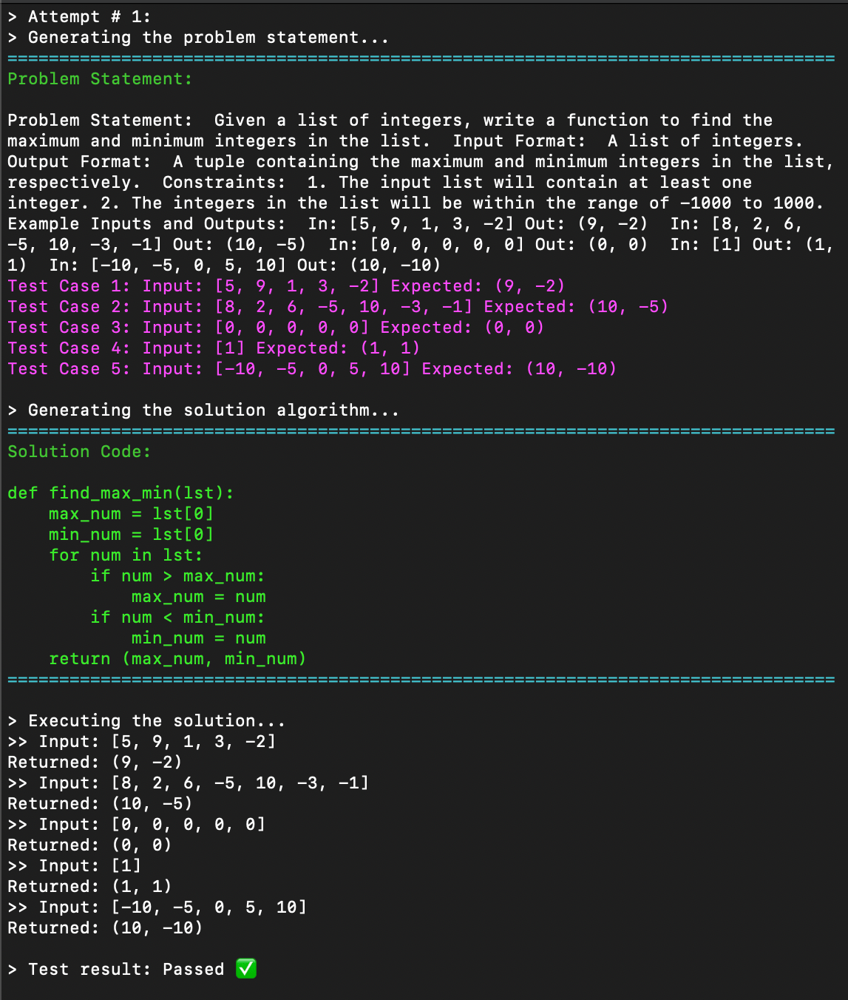

# GPT Coder: Coding Challenge Generator and Solver

## Description

This repository contains An automated python code generation tool utilizing OpenAI's GPT API, to produce code challenges and their corresponding solutions. The application employs a self-supervising approach that iteratively refines, compiles, and tests the generated solutions, aiming for accuracy and functionality.

Key components of the project include:

- Code challenge generation: Generate code challenges using GPT models.
- Solution generation: Obtain algorithm solutions for the given code challenges.
- Test case parsing: Extract test cases from the code challenge.
- Auto-refining loop: Refine the generated solutions until they meet the expected criteria.
- Code execution, compilation, and testing: Evaluate the generated solutions against the test cases.

## Getting Started

These instructions will guide you through the process of setting up the project on your local machine.

### Prerequisites

- Python 3.7 or higher
- OpenAI API key (You can obtain one by signing up at [OpenAI](https://beta.openai.com/signup/))
- Required Python libraries (Install using `pip install -r requirements.txt`)

### Usage

1. Clone the repository and navigate to the project directory.
2. Create a `.env` file in the project directory and add your OpenAI API key: `OPENAI_API_KEY=your_api_key_here` OR you can rename the `.env.example` and use it instead.
3. Run the `main.py` script: `python src/main.py`
